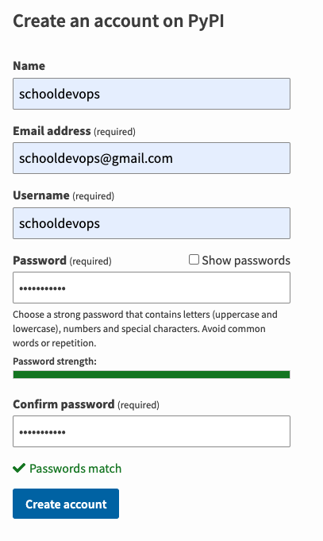
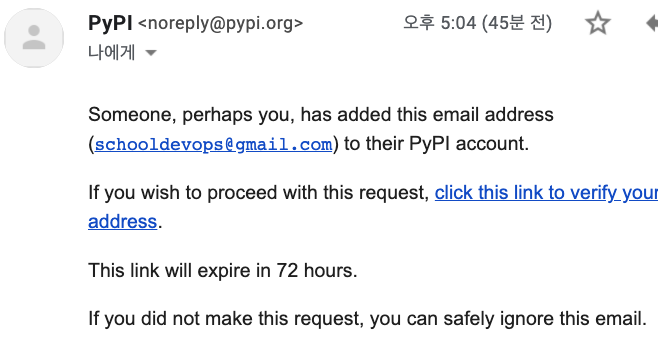
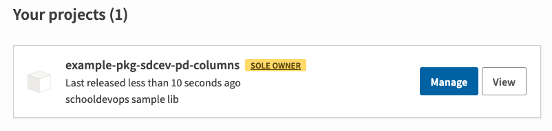

# Python 패키지 생성하고 PyPI에 등록하기

- Python을 이용하면서 `pip install` 명령어를 통해서 원하는 패키지를 등록하고, 프로그래밍을 하는게 보통이다. 
- 그렇다면 Python 패키지는 어떻게 만들고, `pip install` 을 이용하여 파이썬 패키지를 설치하는 것은 어떻게 만들까? 
- 이번 아티클에서는 패키지를 생성하고, 빌드, 긜고 PyPI 에 업로드 하는 방법에 대해서 알아볼 것이다. 

## 진행과정 

1. [PyPI](https://pypi.org/account/register/) 에 접근하여 계정 등록을 한다. 
2. 프로젝트 구조 생성하기. 
3. 모듈 작성하기 
4. 패키지 파일 작성하기
   1. pyproject.toml 파일 생성 
   2. meatdata 작성하기
   3. README.md 파일 작성하기
   4. LICENSE 파일 작성하기
5. 빌드하기
   1. 빌드모듈 설치
   2. 빌드
6. 패키지 업로드 하기 
   1. 패키지 업로드 모듈 설치하기
   2. 패키지 업로드
7. 패키지 설치
8. 테스트 프로그램 수행하기

## 계정 등록 

[PyPI](https://pypi.org/account/register/) 에 접근하여 다음과 같은 형태로 자신의 계정을 생성한다. 

 

- 위와 같이 이름, 메일, 비밀번호를 등록한다. 



- 메일 인증을 하고나면 정상적으로 PyPI를 이용할 수 있다. 

## 프로젝트 구조 작성하기. 

프로젝트 구조는 다음과 같이 작성하자. 

```go
- scdev_kit
  - src
    - scdev_pd_column
      - __init__.py
      - example.py
  - LICENSE.txt
  - pyproject.toml
  - README.md
  - setup.py
```

- scdev_kit: 프로젝트 디렉토리로 보면 된다. 
- src: 소스가 들어 있는 위치이다. 
- scdev_pd_column: 소스내부에 패키지 이름이 된다. 
- __init__.py: 패키지 디렉토리 내부에 파일들이 모듈임을 알려준다. 
- example.py: 모듈이 작성된 파일이다. 
- LICENSE.txt: 패키지의 라이선스를 정의한 파일이다. 
- pyproject.toml: 프로젝트에 필요한 라이브러리에 대한 내역을 기술해준다. 
- README.md: 프로젝트 라이브러리 사용 설명서를 기술한다. 
- setup.py: 빌드를 위한 빌드 정보를 기술하는 파일이다. 

위와 같이 구조는 프로젝트 빌드를 위한 기본 구조이다. 

이러한 구조 형식은 대부분의 폴젝트 빌드시 동일하므로 숙지하는 것이 좋다. 

## 모듈 작성하기 

이제는 모듈을 작성해 보자. 

### 필요한 패키지 설치 

우리는 pandas 를 이용하므로 다음과 같이 패키지를 설치해주자. 

```go
% python -m pip install --upgrade pip
% python -m pip install --upgrade pandas
```

우리는 pandas 패키지를 이용하여, 특정 데이터프레임의 칼럼 이름을 이용하여 해당 칼럼의 모든 데이터를 추출하는 간단한 샘플이다. 

- example.py 을 다음과 같이 작성해 준다. 

```python
"""판다스 칼럼 조회하기"""
import pandas as pd 

def getColumn(df, columnName):
  return df.loc[:,[columnName]]

```

## 패키지 파일 작서하기. 

이제 패키지를 생성하기 위한 파일들을 작성할 것이다. 

파일은 이전 구조 설명시에 모두 빈 파일을 만들어 두었고, 내용을 어떻게 작성하고, 해당 내용에 들어간 소스에 대한 설명을 할 것이다. 

### pyproject.toml 파일 생성 

pyproject.toml 파일은 빌드 툴에게 (pip 혹은 build) 프로젝트 빌드를 위해서 필요한 의존성을 알려준다. 

이 튜토리얼에서는 setuptools과 wheel 을 이용할 것이다. 

```python
[build-system]
requires = [
    "setuptools>=42",
    "wheel"
]
build-backend = "setuptools.build_meta"

```

- build-system.requires:
  - 패키지의 목록을 나열한다.
  - 패키지 빌드를 위해서 필요한 항목을 지정한다. 
  - 여기에 항목을 나열하면 설치 후가 아니라 빌드 중에만 사용하게 된다.

- build-system.build-backend:
  - 파이썬 객체의 이름이다. 
  - 이는 빌드를 수행할 때 Python 객체 이름이다. 
  - 만약 다른 빌드 시스템을 이용한다면 여기에 기술해 주면 된다. 

### metadata 파일 작성하기. 

이제 메타 데이터를 작성할 차례이다. 

메타 데이터는 setup.cfg와 setup.py 를 생성할 수 있다. 

https://packaging.python.org/en/latest/tutorials/packaging-projects/ 에서 Configuring metadata 를 참조하자. 

- setup.cfg:
  - 매번 동일한 빌드를 수행할 수 있도록 정적 메타 데이터이다. 
  - 이는 단순하고, 읽기 쉽고, 많은 공통적인 에러를 피할 수 있다. (인코딩 같은 에러)
- setup.py:
  - 고정되지 않은 동적 빌드를 위해서 사용된다. 
  - 모든 아이템은 동적 혹은 설치시 결정되는 모듈을 작성한다. 

- setup.py 파일을 다음과 같이 작성하자. 

```python 
import setuptools

with open("README.md", "r", encoding="utf-8") as fh:
    long_description = fh.read()

setuptools.setup(
    name="example-pkg-scdev-pd-columns",
    version="0.0.1",
    author="Schooldevops",
    author_email="schooldevops@gmail.com",
    description="schooldevops sample lib",
    long_description=long_description,
    long_description_content_type="text/markdown",
    url="https://github.com/schooldevops/python-tutorials",
    project_urls={
        "Bug Tracker": "https://github.com/schooldevops/python-tutorials/issues",
    },
    classifiers=[
        "Programming Language :: Python :: 3",
        "License :: OSI Approved :: MIT License",
        "Operating System :: OS Independent",
    ],
    package_dir={"": "src"},
    packages=setuptools.find_packages(where="src"),
    python_requires=">=3.6",
)
```

- name: 배포할 패키지의 이름을 작성한다. 문자열, '_', '-' 이 올 수 있다. 
- version: 배포할 패키지의 버젼을 기술한다. 
- author: 배포를 수행한 사람, 조직을 기술한다. 
- author_email: 배포자의 메일주소
- description: 단순한 설명을 기술한다. 
- long_description: README.md 에서 읽은 내용을 추가한다. 
- long_description_content_type: 설명 파일의 컨텐츠를 작성한다. 여기서는 text/markdown 으로 마크다운임을 나타낸다. 
- url: 프로젝트 홈페이지 url을 기술한다. 
- project_urls: PyPI에서 보여줄 추가적인 링크를 나타낸다. 깃헙과 같은 소스 리포지토리가 보통 들어간다. 
- classifiers: 패키지를 위한 몇가지 추가적인 메타 데이터를 나열한다. 파이썬 패키지, 라이선스, 운영체제 등을 기술하였다. 
- package_dir: 패키지 이름들과 디렉토리를 기술한다. 비어있는 값은 루트 패키지의 값으로 여기서는 src를 작성했다 src 하위에 패키지가 포함되어 있음을 확인하자. 
- package: 모든 파이썬 import packages의 목록이다. 여기에는 배포되는 패키지를 포함한다. 
- python_requires: 파이썬 버젼을 기술한다. 

위와 같이 메타데이터를 작성하면, 패키지 빌드에서 사용할 다양한 설정, 빌드 결과물에 대한 설정을 이용하게 된다. 

### README.md

이제 패키지 사용 설명서를 작성한다. 

- README.md 파일을 다음과 같이 작성하자. 

```markdown
# Example Of Pandas Columns

- this is sample of pandas columns 

```

여기서는 단순하게 작성했다. 실제 프로젝트는 좀더 친절하게 작성해주자. 

### LICENSE 파일 작성하기. 

- 배포할 패키지의 라이선스를 작성한다. 
- [choosealicense.com](https://choosealicense.com/) 에서 필요한 라이선스를 선택하고 복사하고, 필요한 내용만 바꿔도 된다. 

```go
Copyright (c) 2022 Schooldevops 

...
```

## 빌드하기

이제 필요한 패키징 파일을 다 작성했다. 빌드를 수행하여 패키지 파일을 생성하자. 

### 빌드 모듈 설치 

빌드 모듈은 다음과 같이 설치하자. 우리는 build 를 설치할 것이다. 

```go
% python -m pip install --upgrade build
```

### 빌드 수행하기

이제 프로젝트 디렉토리에 이동해서 다음 명령어를 실행하자. 

```go
% cd scdev_kit

% python -m build
```

빌드를 수행하고 나면 다음 파일이 생성된다.

```go
- scdev_kit
  - example_pkg_sdcev_pd_columns-0.0.1-py3-none-any.whl
  - example-pkg-sdcev-pd-columns-0.0.1.tar.gz
```

- tar.gz 는 소스 아카이브 이다. 
- whl 파일은 빌드된 배포 본이다. 

## 패키지 업로드 

패키지 업로드를 위해서는 twine 패키지를 이용하여 업로드 하게 된다. 

### 업로드 모듈 패키지 설치하기

```go
% python -m pip install --upgrade twine
```

위와 같이 설치한다. 

### 패키지 업로드하기.

이제 패키지를 PyPI 에 업로드 할 차례이다. 

```go
% python -m twine upload dist/*
Uploading distributions to https://upload.pypi.org/legacy/
Enter your username: schooldevops
Enter your password: 

```

사용자 이름과 비밀번호를 입력하면 패키지가 업로드 된다. 

```go
Uploading example_pkg_sdcev_pd_columns-0.0.1-py3-none-any.whl
```



- 위와 같이 정상으로 패키지가 업로드 되었음을 확인할 수 있다. 


## 패키지 설치하기

이제 자신의 로컬 PC에 패키지를 설치해보자. 

패키지 설치시 패키지 이름은 우리가 setup.py 에 지정한 name 이름이다. 

```go
% python -m pip install --upgrade example-pkg-sdcev-pd-columns
...
```

설치가 된것을 확인해보자. 

```go
% python -m pip list | grep example

example-pkg-sdcev-pd-columns 0.0.2
```

## 테스트하기. 

이제 우리가 생성하고 다운로드 및 설치한 패키지를 이용해보자. 

특정 디렉토리를 만들고 test.py 파일을 만들고 다음과 같이 입력하자. 

```python
import pandas as pd 
from scdev_pd_column import example as ex

def do_example():
  data = {'Name': ['Tom', 'Joseph', 'Krish', 'John'], 'Age': [20, 21, 19, 18]}  
  df = pd.DataFrame(data)
  
  print(df)
  
  colVal = ex.getColumn(df, 'Age')
  print(colVal)
  
do_example()
  
```

- 패키지를 이용하기 위해서 `scdev_pd_column import example as ex` 로 패키지를 임포트 했다. 
- scdev_pd_column 은 우리가 만든 패키지(디렉토리) 이다. 
- 모듈은 example 이다. 이를 단축 이름으로 쓰고자 as ex 라고 했다. 

- 이후 ex.getColumn 메소드를 호출했다. 

그리고 다음과 깉이 실해해보자. 

```go
% python test.py
```

결과는 다음과 같다. 

```go
python test.py 
     Name  Age
0     Tom   20
1  Joseph   21
2   Krish   19
3    John   18
   Age
0   20
1   21
2   19
3   18
```

- pandas 데이터 프레임을 출력했다. 
- 그리고 Age 칼럼 내용만 뽑아서 화면에 출력했다. 

## 결론

우리는 파이썬 패키지 생성예제를 따라하면서 패키지를 어떻게 생성하는지 알아보았다. 

디렉토리 구조는 어떻게 작성하는지, 패키지 빌드를 위한 설정 파일 작성, 그리고 PyPI에 계정을 만들고, 업로드를 수행했다. 

마지막으로 여트 파이썬 패키지처럼 install 하고 사용해 보았다. 

이제 파이썬으로 자신만의 패키지를 만들고, 배포해보자~.
