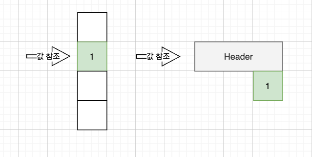

# Numpy 배열 데이터 타입 알아보기.

numpy 는 ndarray 라는 배열을 이용한다. 

numpy의 ndarray는 파이썬 배열에 비해서 성능이 뛰어나며, 이는 python array와 다른 자료 구조를 가지고 있기 때문에 그렇다. 

## Python의 데이터 저장 

- Python은 내부적으로 C로 구현이 되어 있으며, Python은 동적 자료형을 지원한다. 
- C의 경우 정적 자료형을 지정하며, 데이터를 참조하기 위해서 자료의 위치를 알리는 포인터를 이용하며, 정적 자료형이기 때문에 해당 포인터에서 데이터 타입까지 내용을 읽어 데이터를 조회할 수 있는 것이다. 

- Python 의 경우에는 역시 포인터를 이용한다. 그러나 동적 자료형이기 때문에 자료의 위치를 나타내는 포인터만으로 동적 자료형을 표현할 수 없다. 
- 그래서 데이터 형을 지정할 수 있는 헤더와 실제 데이터를 함께 저장하게 된다. 
- 헤더 정보는 다음과 같은 정보가 들어있다. 
  - 레퍼런스 카운터: 데이터를 위한 메모리할당, 해제를 하는 목적이다. 
  - 타입: 자료형을 나타낸다. 
  - size: 데이터의 크기를 나타낸다. 
  - digit: 실제 데이터를 나타낸다. 



- 왼쪽은 C의 데이터와 데이터 참조를 나타낸다. 
- 오른쪽은 Python의 데이터와 데이터 헤더, 데이터 참조를 나타낸다. 

## Python List와 Numpy 배열 

파이썬에서 데이터 저장 방식에 대해 이해 했다면 이제 이를 기반으로 Python List와 Numpy 의 배열 차이점을 알아보자. 

- 파이썬 List의 특징 
  - 파이썬 배열은 동적 자료형을 가질 수 있기 때문에 다양한 타입의 데이터를 저장할 수 있다. 
  - 유연성이 높은 장점이 있다. (다양한 데이터 타입 저장 가능)
  - 리스트의 인덱스마다 데이터 타입을 조회해야하기 때문에 속도가 느리다. 

- Numpy 배열의 특징
  - Numpy 배열은 배열을 동일한 타입으로 고정한다.
  - 서로다른 데이터 타입이 들어오는 경우라면, 업캐스팅 (수퍼캐스팅)을 수행하여 자료형을 결정 짓는다. 
  - 동일한 데이터 타입을 사용하고, 파이썬의 데이터 헤더를 사용하지 않으므로 속도가 빠르다. 


from: https://jakevdp.github.io/PythonDataScienceHandbook/02.01-understanding-data-types.html

- 위 그림을 확인해보면 numpy ndarray와 python list와 차이점을 명확히 확인할 수 있다. 
  
- Numpy ndarray의 구조  
  - head: ndarray는 동일한 타입을 가지므로 ndarray를 위한 헤더 하나만 지정한다. 
  - data: 데이터를 참조하는 데이터 시작 위치 포인터를 다음으로 갖는다. 
  - dimensions: 배열의 차원을 나타낸다. 
  - strides: 배열 폭
- 위 그림과 같이 ndarray는 중복을 최대한 제거하고, 데이터는 컴팩트하게 저장하고 있다. 
- 그러므로 속도가 매우 빠르다는 것을 이해할 수 있다. 

- Python List 구조 
  - head: 리스트 자체를 나타내는 헤더를 가진다.
  - length: 파이썬 리스트의 길이를 나타낸다. 
  - items: 실제 저장된 데이터를 가리킨다.. 
    - items: 각각은 이전에 확인한 python 동적 자료형의 구조를 그대로 저장한다. 
- 위 그림과 같이 python list는 매번 데이터에 접근할때마다, 데이터 자료형을 확인하고, 자료형에 따라 바이트를 읽고, 데이터를 참조해야한다. 
- 당연히 유연성은 뛰어나며, 속도는 느림을 확인할 수 있다. 

### Python List 복수 자료형 예제 

- Python list가 서로다른 자료형을 저장할 수 있다는 것을 다음 에제로 확인할 수 있다. 

```python 
# 다양한 자료형을 저장할 수 있다. 
lst = ['Hello', 10, True, False, 10.1]
print(lst)

결과:
['Hello', 10, True, False, 10.1]
```

```python
# list를  순회하면서 타입을 출력해본다. 
[print(type(value)) for value in lst]

<class 'str'>
<class 'int'>
<class 'bool'>
<class 'bool'>
<class 'float'>
```

- 그림과 같이, str, int, boolean, float 등의 자료형을 저장할 수 있다. 

## Numpy 배열 생성하는 다양한 방법

- Numpy 배열 생성은 다양한 벙법이 있다. 
- 기본적으로 Python 리스트로 배열을 생성할 수 있다. 
- 또한 Numpy 자체 내장된 함수를 이용하여 배열을 생성할 수 있다. 

### Python list 를 활용하여 배열 생성하기. 

```python
# numpy 를 import 한다. 
import numpy as np

# python 리스트 생성하기. 
lst = [0, 1, 2, 3, 4, 5, 6, 7, 8, 9]

# numpy ndarray 생성하기 
ndarr = np.array(lst)

# 각 타입을 확인해보기 
print(type(lst))
print(type(ndarr))
print(ndarr)

결과:  
<class 'list'>
<class 'numpy.ndarray'>
[0 1 2 3 4 5 6 7 8 9]
```

- 살펴본 바와 같이 python list를 출력했다. 
- numpy.ndarray 가 np.array로 생성되었음을 알 수 있다. 
- ndarray의 결과를 확인할 수 있다. 

### 타입 업캐스팅

- numpy 는 데이터타입을 통일하기 위해서 서로다른 데이터타입(숫자형)이 들어오면 업캐스팅 된다. 

```python 
lst1 = [1, 2, 3.4, 4, 5, 6]
ndarr1 = np.array(lst1)
print(ndarr1)
print(type(ndarr1[0]))

결과:  
[1.  2.  3.4 4.  5.  6. ]
<class 'numpy.float64'>
```

- 위 내용을 보면 lst1 은 python list이며, 정수, float타입이 혼재한다. 
- 데이터 타입이 numpy.float64 로 업캐스팅 된 것을 확인할 수 있다. 

### 타입 지정하여 배열 생성하기. 

- numpy.ndarray를 생성할때, 타입을 지정할 수 있다. 
- dtype=<자료형> 을 파라미터로 전달하면 생성이 가능하다. 

```python
lst1 = [1, 2, 3.4, 4, 5, 6]
ndarr1 = np.array(lst1, dtype=int)
print(ndarr1)
print(type(ndarr1[0]))

결과:  
[1 2 3 4 5 6]
<class 'numpy.int64'>
```

- 위 결과 모두 정수형 타입으로 변경이 되었고, 소숫점 자리는 제거 되었다. 

```python
lst1 = [1, 2, 3.4, 4, 5, 6]
ndarr1 = np.array(lst1, dtype=float)
print(ndarr1)
print(type(ndarr1[0]))

결과: 
[1.  2.  3.4 4.  5.  6. ]
<class 'numpy.float64'>
```

- float 타입으로 생성이 되었다. 

```python
lst1 = [1, 2, 3.4, 4, 5, 6]
ndarr1 = np.array(lst1, dtype=str)
print(ndarr1)
print(type(ndarr1[0]))

결과: 
['1' '2' '3.4' '4' '5' '6']
<class 'numpy.str_'>
```

- 문자타입으로 변경된 것을 확인할 수 있다. 

### ndarray 다차원 배열 생성하기 

```python
ndarr1 = np.array([range(i, i + 2) for i in [2, 3, 4]])
print(ndarr1)

결과: 
[[2 3]
 [3 4]
 [4 5]]
```

- range를 이용하여 범위 값을 이용하여 배열이 생성되었다. 

### 0으로 채워진 배열 생성하기. 

- numpy에서는 zeros라는 메소드를 이용하여 초기 값이 0인 배열을 생성할 수 있다.

```python
ndarr1 = np.zeros(10, dtype=float)
print(ndarr1)

결과: 
[0. 0. 0. 0. 0. 0. 0. 0. 0. 0.]
```

- 1차원 배열로 10개의 아이템을 가진 배열이 생성되었다. 
  
```python
ndarr1 = np.zeros((2, 3), dtype=float)
print(ndarr1)

결과:
[[0. 0. 0.]
 [0. 0. 0.]]
```

- 2생 3열로 구성된 2차원 배열이 생성 되었고, 0으로 채워진 배열이다. 

### 1로 채워진 배열 생성하기. 

- numpy는 ones를 이용하여 1로 채워진 배열도 생성할 수 있다. 

```python
ndarr1 = np.ones(10, dtype=float)
print(ndarr1)

결과: 
[1. 1. 1. 1. 1. 1. 1. 1. 1. 1.]
```

- 결과와 같이 1로 채워진 1차원 배열이 생성되었다.
- 10개의 float타입의 배열이다. 

```python
ndarr1 = np.ones((2, 3), dtype=float)
print(ndarr1)

결과: 
[[1. 1. 1.]
 [1. 1. 1.]]
```

### 지정된 값으로 초기화된 배열 생성하기. 

- full 메소드를 이용하면 원하는 값으로 채워진 배열을 생성할 수 있다. 

```python
ndarr1 = np.full(10, 5, dtype=float)
print(ndarr1)

결과: 
[5. 5. 5. 5. 5. 5. 5. 5. 5. 5.]
```

- 겨로가를 보면 5로 채워진 아이템 10개의 1차원 배열을 생성했다. 
- 데이터 타입은 float 이다. 

```python
ndarr1 = np.full((2, 5), 3.14)
print(ndarr1)

결과: 
[[3.14 3.14 3.14 3.14 3.14]
 [3.14 3.14 3.14 3.14 3.14]]
```

- 2행 5열의 2차원 배열이 생성이 되었다. 
- 데이터는 3.14로 채워져 있다. 

### 지정된 범위로 배열 생성하기. 

- arange를 이용하면 배열을 특정 범위에 증가되는 스텝을 기준으로 생성한다. 
- arange(start, stop, step)

```python
ndarr1 = np.arange(0, 10, 2)
print(ndarr1)

결과: 
[0 2 4 6 8]
```

- 시작값 0 부터 종료값 10 까지 2씩 증가하는 값의 배열을 생성했다.
- 중요한 것은 종료값은 포함되지 않았음을 확인하자. 

```python
ndarr1 = np.arange(0, 11, 2)
print(ndarr1)

결과:
[ 0  2  4  6  8 10]
```

- 마지막 10까지 포함하고 싶다면 stop + 1 의 값을 지정해주자. 

### 범위 내에 생성하고자 하는 개수만큼 균등하게 분할된 배열 생성하기. 

- 이제 범위내에 지정된 개수의 배열을 만들어 보자. 
- 생성된 아이템은 균등하게 분할된 값으로 생성이 되어야한다. 
- 이럴때 사용하는 메소드가 numpy.linspace 이다. 

```python
ndarr1 = np.linspace(0, 10, 5)
print(ndarr1)

결과: 
[ 0.   2.5  5.   7.5 10. ]
```

- 0에서 10까지 숫자중에서 균등한 5개의 아이템을 가진 배열을 만든다. 
- 시작, 종료값은 결과에 포함되는 것을 알 수 있으며, 우리가 원한 0, 2.5, 5, 7.5, 10 의 값을 가진 배열임을 확인할 수 있다. 

### 랜덤한 배열 생성하기. 

- 랜덤값을 아이템으로 가진 배열을 생성할 수 있다. 

```python
np.random.seed(1000)
ndarr1 = np.random.random((3, 3))
print(ndarr1)

결과: 
[[0.65358959 0.11500694 0.95028286]
 [0.4821914  0.87247454 0.21233268]
 [0.04070962 0.39719446 0.2331322 ]]
```

- np.random.seed(초기값): 이를 통해 랜덤북을 선택할 수 있다. seed도 랜덤하게 지정하면 매번 자연난수에 가까운 값을 생성할 수 있다. 


```python
ndarr1 = np.random.randint(0, 10, (3, 3))
print(ndarr1)

결과:
[[8 0 2]
 [9 3 9]
 [6 2 9]]
```

- 0에서 10 사이의 정수값을 이용하여 3행 3열의 배열을 생성한다. 

### 단위행렬 생성하기. 

- eye 함수를 이용하여 단위행렬을 생성할 수 있다. 
- 단위행렬은 대각선이 1, 나머지는 0의 값을 갖는다. 

```python
ndarr1 = np.eye(3, 3)
print(ndarr1)

결과: 
[[1. 0. 0.]
 [0. 1. 0.]
 [0. 0. 1.]]
```

### 초기화 되지 않은 배열 생성하기. 

- 초기화 되지 않은 배열을 생성한다. 
- 값은 물론 메모리도 초기화 되지 않음을 이해하고 생성해야한다. 

```python 
ndarr1 = np.empty(3)
print(ndarr1)

결과:
array([1., 1., 1.])
```

- 다차원 생성 

```python
ndarr1 = np.empty( (3,3) )
print(ndarr1)

결과:
array([[1., 0., 0.],
       [0., 1., 0.],
       [0., 0., 1.]])
```

- 3 * 3 비어있는 배열을 생성했다. 

### 배열 크기 변경하기. 

- 생성된 배열은 reshape를 이용하여 배열 형태를 변경할 수 있다. 

```python
ndarr1 = np.array([0, 1, 2, 3, 4, 5, 6, 7, 8, 9])
print(ndarr1)

ndarr1 = ndarr1.reshape(2, 5)
print(ndarr1)

결과:  
[0 1 2 3 4 5 6 7 8 9]
[[0 1 2 3 4]
 [5 6 7 8 9]]
```

- 1차원 배열이 2행 5열 배열로 변경된 것을 확인할 수 있다. 
- reshape 결과 값을 ndarr1에 할당해야 결과가 저장된다. 

## WrapUp

- 지금가지 python의 동적 변수할당과 리스트의 구조, numpy의 배열 구조에 대해서 알아 보았다. 
- numpy의 배열을 생성하기 위한 다양한 방법도 알아 보았다. 
- numpy는 데이터 처리를 위한 매우 강력한 메소드와, 성능을 제공한다는 점에서 숙지하면 도움이 될 것이다.  