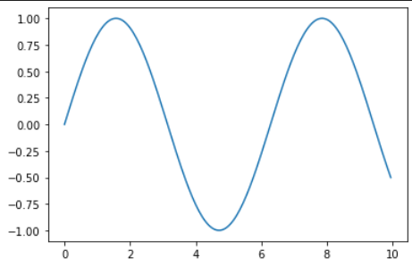
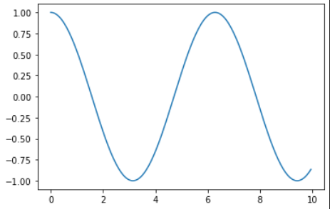
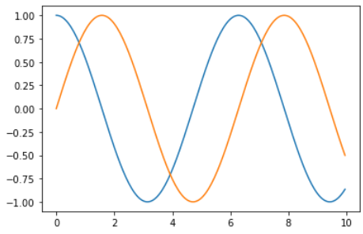
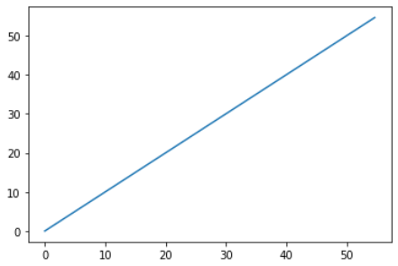
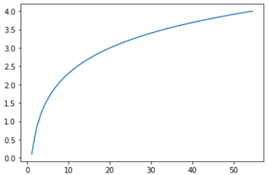

# 수학 함수와 그래프 표현

- numpy 에서는 수학함수를 제공하고 있다. 이를 활용하여 수치 연산, 모델 작성등에 확용할 수 있다. 
- 이번 아티클에서는 수학 함수를 활용하여, 그래프로 표현해 볼 것이다. 
- 그래프 표현을 위해서 matplotlib 라는 강력한 패키지를 활용할 것이다. 

## matplotlib 설치하기. 

```go
pip install matplotlib 
```

## sin, cos, tan

- np.sin, np.cos, np.tan 등으로 삼각함수를 계산할 수 있다. 

```python
# sin 곡선 구하기. 
# x 축은 0 ~ 10까지의 범위를 0.05 간격으로 데이터를 생성한다. 
x = np.arange(0, 10, 0.05)
# y 축은 x축에서 sin 결과를 출력한다. (sin특성상 1에서 -1 범위의 값이 출력된다.)
y = np.sin(x)

plt.plot(x, y)
```



```python
# cos 곡선 구하기. 
# x 축은 0 ~ 10까지의 범위를 0.05 간격으로 데이터를 생성한다. 
x = np.arange(0, 10, 0.05)
# y 축은 x축에서 cos 결과를 출력한다. (cos특성상 1에서 -1 범위의 값이 출력된다. sin과 반대로 움직인다.)
y = np.cos(x)

plt.plot(x, y)
```



```python
# sin, cos 그래프 2개 그래프 함께 그리기 
x = np.arange(0, 10, 0.05)

y_sin = np.sin(x)
y_cos = np.cos(x)

plt.plot(x, y_cos)
plt.plot(x, y_sin)
```



## log

```python
# 선형 그래프 
x = np.linspace(0, 51, 50)
y = x

plt.plot(x, y)
```



- 동일한 값을 출력하면 위와 같이 선형 그래프가 그려진다. 

```python
# log 그래프 
x = np.linspace(0, 51, 50)
y = np.log(x)

plt.plot(x, y)
```



- log 그래프는 위와 같이 해당 값의 log 를 취한 곡선형이 그려진다. 


## 기타

- np.sqrt(): 배열 내의 각 원소에 대해서 스퀘어 루트를 구할 수 있다. 
- np.exp(): 밑이 자연상수 e인 지수함수 (e^x) 로 변환해주는 함수이다. 즉, 배열 원소 각각에 대해서 e^x 를 구해준다. 