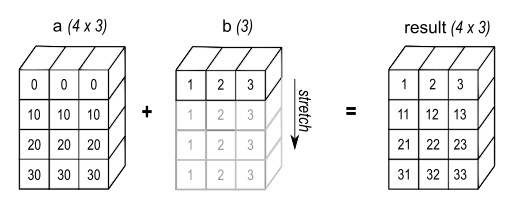
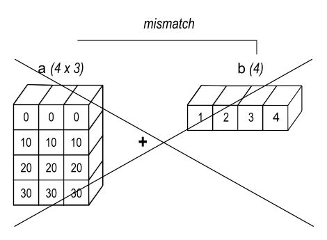
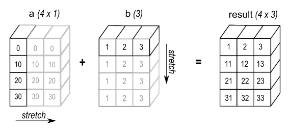

# Numpy Essentials Broadcasting 

- broadcast 는 numpy 에서 서로다른 형태의 배열이 서로 연산을 수행하는 방법을 나타낸다.
- 작은 배열이 큰 배열과 연산을 통해서 최종적인 배열로 확장될 수 있도록 해준다. N

## 스칼라연산에서 broadcasting

- broadcasting 의 가장 쉬운 예는 scalar 연산에서 확인할 수 있다. 

```python
addr1d = np.array([1, 2, 3])
newarr = addr1d * 2
print(newarr)

결과: 
[2 4 6]
```

- 위 결과는 스칼라값 2가 addr1d 의 각 원소에 2를 곱한 결과를 낸다. 
- 위 처리는 사실 다음과 같이 처리된다. 


from: https://numpy.org/doc/stable/user/basics.broadcasting.html

- 위와 같이 스칼라가 addr1d와 동일한 형태로 스칼라 값이 늘어난다. 이를 브로드캐스팅이라고 한다. 
- 브로드 캐스팅은 2의 값을 3개 가진 1차원 배열을 별도로 만드는것 보다 메모리를 적게 차지한다. 

## 2차원 배열과 1차원 배열의 브로드 캐스팅 

- 2차원 배열과 동일한 칼럼 개수를 가진 1차원 배열이면 브로드캐스팅 된다. 

```python
# 2차원 배열과 1차원 배열의 broadcasting
arr2d = np.array([[0, 0, 0], [10, 10, 10], [20, 20, 20], [30, 30, 30]])
arr1d = np.array([1, 2, 3])

added_arr = arr2d + arr1d 
print(added_arr)

결과: 
[[ 1  2  3]
 [11 12 13]
 [21 22 23]
 [31 32 33]]
```

- 위 연산은 아래 그림과 깉이 일어난다. 



from: https://numpy.org/doc/stable/user/basics.broadcasting.html

- 즉 arr2d의 칼럼 개수와 arr1d의 원소 개수는 동일하다. 
- 그러므로 arr1d가 아래 방향으로 확장이 되고, arr2d와 동일한 형태의 shape를 가지게 된다. 
- 이후 연산을 수행하여 결과를 반환한다. 

## broadcasting 오류케이스 

```python
# 브로드캐스팅 오류 
arr2d = np.array([[0, 0, 0], [10, 10, 10], [20, 20, 20], [30, 30, 30]])
arr1d = np.array([1, 2, 3, 4])

added_arr = arr2d + arr1d 
print(added_arr)

결과: 
ValueError                                Traceback (most recent call last)

... 생략 
ValueError: operands could not be broadcast together with shapes (4,3) (4,) 
```

- 결과와 같이 브로드캐스팅을 수행할 수 없다는 오류가 난다. 



- 즉, (4, 3) 과 (4, )은 서로 shape가 맞지 않기 때문이다. 

## 행만 존재하는 2차원 배열과 1차원 배열의 브로드캐스팅 

- 이제 행만 존재하는 2차원 배열과 1차원 배열의 브로드캐스팅 예제를 보자. 

```python
# 행만 존재하는 2차원 배열과 1차원 배열의 브로드캐스팅
arr2d_just_1columns = np.array([[0], [10], [20], [30]])
print(arr2d_just_1columns)

결과: 
[[ 0]
 [10]
 [20]
 [30]]

arr1d = np.array([1, 2, 3])
print(arr1d)

결과:
[1 2 3]

new_array = arr2d_just_1columns + arr1d 
print(new_array)

결과: 
[[ 1  2  3]
 [11 12 13]
 [21 22 23]
 [31 32 33]]
```

- 첫번재 칼럼만 있는 2차원 배열의 결과를 우선 확인하자. 
- 그리고 1차원 배열 1, 2, 3 만 있는 배열도 확인한다. 
- 두 배열을 더하면 브로드캐스팅이 발생하며, 최종결과는 마지막 2차원 배열값을 확인할 수 있다. 



from: https://numpy.org/doc/stable/user/basics.broadcasting.html

- 다음과 같이 1차원 배열2개로 만들수도 있다. 

```python
# np.newaxis 를 이용하여 배열 2차원 배열 생성후 브로드캐스팅 
arr1d_01 = np.array([0, 10, 20, 30])
arr1d_02 = np.array([1, 2, 3])
new_array = arr1d_01[:, np.newaxis] + arr1d_02

print(new_array)

결과: 
[[ 1  2  3]
 [11 12 13]
 [21 22 23]
 [31 32 33]]
```

- np.newaxis 와 slice를 이용하면 arr1d_01을 이전 예제의 2차원 배열로 만들수 있다. 

